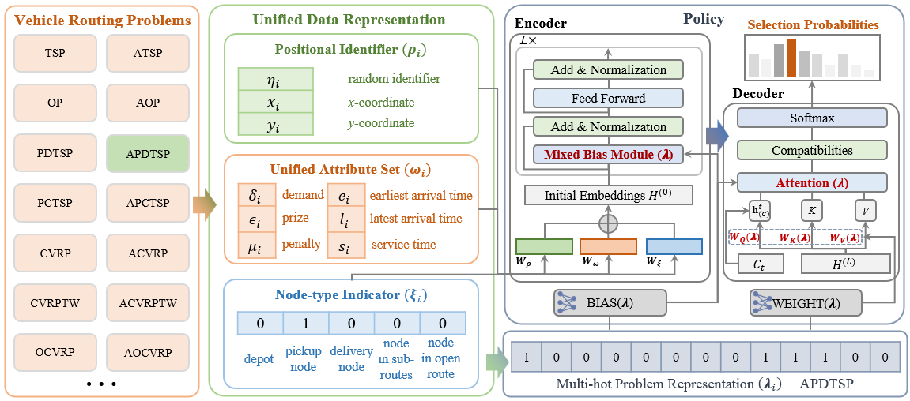

## [ICML 2026] URS: A Unified Neural Routing Solver for Cross-Problem Zero-Shot Generalization

This repository contains the official implementation of [**URS: A Unified Neural Routing Solver for Cross-Problem Zero-Shot Generalization**](https://arxiv.org/abs/2509.23413). URS is a reinforcement-learning-based constructive neural solver designed to solve many vehicle routing problems (VRP) variants with a single model. URS uses a **Unified Data Representation (UDR)**, a **Mixed Bias Module (MBM)**, adaptive parameter generation, and stepwise feasibility masks to handle diverse constraints and generalize to a wide range of unseen VRP variants without any fine-tuning.



## What You Can Do

- `One-click evaluation of multiple VRP variants` (up to 110) via the provided generalist checkpoint.
- Evaluate specialist checkpoints trained for the 11 training problems.
- Evaluate on TSPLIB and CVRPLIB benchmark instances.
- Train your unified model from scratch using the default 11 training problems or additional problems.

## Naming Guide

The current codebase supports generating high-quality solutions for **110** diverse VRP variants. See `problem.ProblemDef.py` for a detailed definition of each problem. Problem names are compositional. Common tokens include:

| Token | Meaning |
| --- | --- |
| `a` | Asymmetric distances, such as atsp |
| `c` | capacity constraint |
| `md` | Multi-depot VRP |
| `o` | Open route, where vehicles do not need to return to the depot |
| `l` | Duration limit |
| `tw` | Time windows with service times |
| `b` | Backhaul customers |
| `bp` | Backhaul and priority |
| `pd` | Pickup and delivery |
| `pc` | Prize-collecting or penalty-based routing, such as PCTSP/SPCTSP |

## Repository Layout

```text
.
|-- train.py        # Main training entry point
|-- test.py         # Main testing entry point for synthetic sets and benchmarks
|-- Trainer.py      # Reinforcement learning training loop
|-- Tester.py       # Evaluation on saved synthetic datasets
|-- Tester_Bench.py # Evaluation on TSPLIB/CVRPLIB benchmark files
|-- args.py         # Shared command-line arguments
|-- model/          # backbone of URS
|-- env/            # Unified VRP environment and constraint masks
|-- problem/        # Problem sets, random generators, and multi-hot problem representations
|-- data/           # Saved dataset discovery and loading utilities
|-- pretrained/     # Pretrained checkpoints
|-- dataset/        # Test and validation datasets
|-- utils/          # Logging, plotting, seeding, and helper utilities

```

## Requirements

The code is pure Python and PyTorch. A CUDA-enabled GPU is recommended for training and evaluation. We don't use any hard-to-install packages. If any package is missing, just install it following the prompts.

```text
Python >= 3.8.0
PyTorch >= 2.0.1
numpy
openpyxl
```

## Data and Checkpoints

**Pretrained models:** download one unified checkpoint and eleven specialist checkpoints from [Google Drive](https://drive.google.com/drive/folders/11d_Ot9hMOeDRAENP9XtgH_H3n1UhvYHO?usp=sharing) and place them in `./pretrained/`

**Datasets:** download the test sets for the evaluated problems and benchmark datasets from [Google Drive](https://drive.google.com/drive/folders/1Ptj4a78kZUITdvp7DW3tPw5D0o9wHne5?usp=sharing) and place datasets in `./dataset/`


## Evaluation
You can pass `--problem_set` in three ways:

1. A predefined problem list, which can be found in `problem.ProblemSet.py`
2. A comma-separated list of specific problem names.
3. A benchmark alias: `tsplib` or `cvrplib`.

For synthetic evaluations, `DataFinder` expects one subdirectory per problem name. For example:

```text
dataset/
|-- tsp/
|-- cvrp/
...
```

For TSPLIB and CVRPLIB, the benchmark tester recursively searches the directory passed through `--data_dir` for `.tsp` or `.vrp` files.

## Quick Start

All commands below assume you are in the repository root:

```bash
cd URS
```

Evaluate one problem at scale 100:

```bash
python test.py --problem_set tsp --test_scale_list 100 --test_episodes 1000
```

Evaluate a custom list:

```bash
python test.py --problem_set tsp,cvrp,pdcvrp --test_scale_list 100 --test_episodes 1000
```

Evaluate all `110` defined problems:

```bash
python test.py --problem_set all_evaluated_list --test_scale_list 100 --test_episodes 1000
```

Evaluate multiple scales. The number of values in `--test_episodes` must match `--test_scale_list`.

```bash
python test.py --problem_set tsp,cvrp --test_scale_list 100 1000 2000 --test_episodes 1000 16 16
```

#### Specialist Checkpoints

```bash
# To evaluate a specialist checkpoint, pass `--model_load`:
python test.py --problem_set cvrp --model_load ./pretrained/cvrp_checkpoint_300.pt --test_scale_list 100 --test_episodes 1000
```


#### TSPLIB and CVRPLIB Benchmarks

Use the benchmark aliases `tsplib` and `cvrplib`. The benchmark tester reads `.tsp` and `.vrp` files recursively from `--data_dir`.

Evaluate TSPLIB instances:

```bash
python test.py --problem_set tsplib --scale_range_lib 100 1001
```

Evaluate CVRPLIB instances:

```bash
python test.py --problem_set cvrplib --scale_range_lib 3000 7001
```


## Training

Training data is generated on the fly for supported training problems. Validation data is loaded from `./dataset`, so validation files must be prepared before training.

```bash
python train.py --training_epochs 500 --batches_per_epoch 2000 --batch_size 128 --problem_size 100 --validation_scale 100
```

Train with additional problems:

```bash
python train.py --add_training_problems acvrpbtw --validation_problem_set train_problem_list
```

## Notes and Troubleshooting

- If `--test_episodes` and `--test_scale_list` have different lengths, `test.py` raises a `ValueError`.
- If a problem directory or dataset file is missing under `--data_dir`, the evaluation for that problem/scale cannot run.
- For synthetic evaluation, solution files are optional but needed for meaningful gap reporting. Without oracle solutions, some loaders fall back to placeholder scores (i.e., 1.0).
- Large-scale and asymmetric evaluations can require substantial GPU memory. Reduce batch sizes with `--test_batch_size_large` or disable augmentation with `--disable_aug` if needed.
- Benchmark evaluation supports only one benchmark family at a time: `--problem_set tsplib` or `--problem_set cvrplib`.

## Citation

If this repository is helpful for your research, please cite our paper:

```bibtex
@inproceedings{zhou2026urs,
  title={URS: A Unified Neural Routing Solver for Cross-Problem Zero-Shot Generalization},
  author={Zhou, Changliang and Yu, Canhong and Yao, Shunyu and Lin, Xi and Wang, Zhenkun and Zhou, Yu and Zhang, Qingfu},
  booktitle={Forty-third International Conference on Machine Learning},
  year={2026},
  organization={PMLR}
}
```

## Acknowledgements

Some URS implementations build on ideas and code from the following open-source projects. We sincerely appreciate their contributions to neural combinatorial optimization.

- ICAM: [https://github.com/CIAM-Group/ICAM](https://github.com/CIAM-Group/ICAM)
- POMO: [https://github.com/yd-kwon/POMO/tree/master/NEW_py_ver](https://github.com/yd-kwon/POMO/tree/master/NEW_py_ver)
- MatNet: [https://github.com/yd-kwon/MatNet/tree/main](https://github.com/yd-kwon/MatNet/tree/main)
- AM: [https://github.com/wouterkool/attention-learn-to-route](https://github.com/wouterkool/attention-learn-to-route)
- MTPOMO: [https://github.com/FeiLiu36/MTNCO](https://github.com/FeiLiu36/MTNCO)
- MVMoE: [https://github.com/RoyalSkye/Routing-MVMoE](https://github.com/RoyalSkye/Routing-MVMoE)
- RouteFinder: [https://github.com/ai4co/routefinder](https://github.com/ai4co/routefinder)

## Contact
We have verified the legality of the corresponding solutions for each problem. We will continue to strive to improve its clarity and welcome any minor errors in the code implementation.

If there are any issues in running or re-implementing the code, please contact the author Changliang Zhou via email (zhoucl2022@mail.sustech.edu.cn) in a timely manner. 


## Copyright (c) 2026 CIAM Group.

**This code is for non-commercial use only. Please contact the authors for business or commercial use.**
